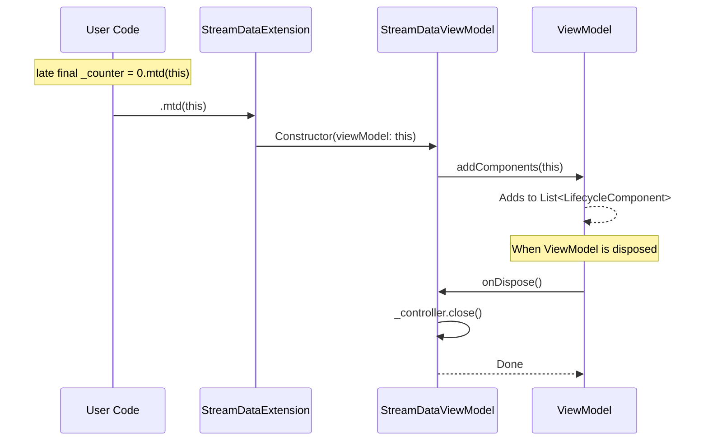

# 🛠️ API Specification: `maac_mvvm` (Core)

`maac_mvvm` is the fundamental package of the MAAC ecosystem. It provides the base classes for the MVVM pattern and a lifecycle management system that mirrors the robustness of Android development.

---

## 📦 Installation

To add the core package to your project, run:

```bash
flutter pub add maac_mvvm
```

---

## 🧠 ViewModel

The `ViewModel` class is the central point for business logic and state management.

### Public Methods & Properties

- **`onInitState()`**: Called when the `ViewModelWidget` is first created. This is the **best place** to trigger initial data fetching or setup listeners.
- **`onResume()`**: Called when the widget becomes visible (e.g., navigating back to this page) or the application comes to the foreground.
- **`onPause()`**: Called when the widget is no longer visible (e.g., navigating away) or the application goes to the background.
- **`onDispose()`**: Called when the widget is permanently removed from the widget tree. Use this to cancel timers, close streams, or release resources.
- **`viewModelScope<G>(Future<G> Function() future, {Key? key})`**: 
    - **How it works**: It wraps a `Future` into a cancellable task. 
    - **Safety**: If the `ViewModel` is disposed while the `Future` is still running, the task is automatically cancelled, preventing "setState after dispose" errors and memory leaks.
- **`addComponents(LifecycleComponent component)`**: Registers external objects (like `StreamDataViewModel`) to follow the ViewModel's lifecycle.

### Lifecycle Synchronization Hooks
MAAC provides hooks for application-level state changes:
- `onApplicationResumed()`: App is in the foreground.
- `onApplicationInactive()`: App is in an inactive state (e.g., phone call).
- `onApplicationPaused()`: App is in the background.
- `onApplicationDetached()`: App is being terminated.

---

## 🌊 StreamData & StreamDataViewModel

The reactive data layer of MAAC.

### `StreamData<T>` (Read-only)
The interface used by UI components to listen to state changes.
- **`data`**: Synchronous access to the current value.
- **`asStream()`**: Returns the underlying broadcast stream.

### `StreamDataViewModel<T>` (Mutable)
The implementation used inside the `ViewModel` to update state.
- **`postValue(T value)`**: Updates the value and notifies all UI listeners. **Note**: It won't notify if the new value is the same as the current one (equality check).
- **`setValue(T value)`**: Updates the value silently (no UI rebuild). Use this for internal state that shouldn't trigger a re-render.
- **`map<R>(Mapper mapper)`**: Creates a derived `StreamData` that updates automatically when the source changes.

---

## 🏗️ ViewModelWidget

A replacement for `StatefulWidget` that automates ViewModel management.

### Overrides
- **`createViewModel()`**: **Required**. Return an instance of your ViewModel here. (Note: No `BuildContext` is passed here to keep ViewModel creation pure).
- **`build(BuildContext context, VM viewModel)`**: **Required**. Build your UI here.
- **`awake(WrapperContext context, VM viewModel)`**: Called after `createViewModel` but before `onInitState`.
    - **Crucial**: Use this to perform logic that depends on `BuildContext` or `LifeCycleManager`.
    - **Best Practice**: Use `awake` to pass parameters (like dynamic IDs) from the UI to the ViewModel. This allows the ViewModel to remain "dumb" about its creation source and trigger its own loading logic within `onInitState`, maximizing encapsulation.

---

## 📊 StreamDataConsumer

A specialized widget for efficient UI updates.

```dart
StreamDataConsumer<T>(
  streamData: viewModel.myData,
  builder: (context, data) {
    return MyWidget(data);
  },
)
```

### Key Features
- **Automatic Subscription**: No need for `StreamBuilder` boilerplate.
- **Automatic Cleanup**: Unsubscribes when the widget is disposed.
- **Value-based rebuilds**: Only rebuilds when the value actually changes (default behavior).
- **Cache control**: An optional `useCache` predicate skips rebuilding for values that
  shouldn't visually change the UI, reusing the previously built child instead.

### Combining Multiple Sources

Reach for `StreamDataConsumer2`/`StreamDataConsumer3` instead of nesting a `StreamDataConsumer`
inside another one — each source's latest value is passed straight into `builder`, fully typed:

```dart
StreamDataConsumer2<bool, List<NewsArticle>>(
  streamData1: viewModel.isLoading,
  streamData2: viewModel.newsState,
  builder: (context, isLoading, news) {
    if (isLoading) return const CircularProgressIndicator();
    return NewsList(news: news);
  },
)
```

For more than 3 sources, drop down to `MergeStreamDataConsumer` — the primitive
`StreamDataConsumer2`/`3` are built on. It only signals "something changed, rebuild"; read
whichever `StreamData.data` you need directly inside the builder. All of these rebuild
whenever **any** source emits — there's no pairing/waiting between sources.

---

## 💡 Technical Rationale & Best Practices

### 1. Why use Private Variables (e.g., `late final _counter = ...`)?
In MAAC, we follow a strict **Unidirectional Data Flow**:
- **ViewModel** holds the **Mutable** state (`StreamDataViewModel`).
- **UI** consumes the **Immutable/Read-only** state (`StreamData`).

By declaring `_counter` as private, we prevent the UI (Widget) from accidentally calling `postValue` or modifying the state directly. The only way to change the state is by calling a public method in the ViewModel (e.g., `increase()`), which ensures business logic is always centralized.

### 2. What is `.mtd(this)`?
The `.mtd(this)` is an extension method that stands for **Member To Dispose** (or *Member To Delegate*).
- **How it works**: When you call `0.mtd(this)`, it creates a `StreamDataViewModel(defaultValue: 0, viewModel: this)`.
- **Why use it**: It automatically registers the data stream into the ViewModel's component list. This ensures that when the ViewModel is disposed, the underlying `StreamController` inside the `StreamDataViewModel` is **automatically closed**, preventing memory leaks without manual cleanup code.

---

## 🛠️ Deep Dive: Lifecycle Delegation

To understand how `.mtd(this)` works under the hood, let's look at the collaboration between four key internal parts of MAAC.

### The 4 Key Players:
1.  **`StreamDataViewModelExtension`**: Provides the `.mtd(this)` syntax to initialize state.
2.  **`StreamDataViewModel`**: The state holder that implements `LifecycleComponent`.
3.  **`ViewModel`**: The manager that keeps track of all registered components.
4.  **`LifecycleComponent`**: An interface that defines the contract for any object wanting to follow the ViewModel's lifecycle.

### Lifecycle Flow Diagram:



### Why this architecture?
This **Delegation Pattern** decouples the ViewModel from the specific logic of its internal states. The ViewModel doesn't need to know *how* to clean up a `StreamDataViewModel`; it only needs to know that every registered component will handle its own cleanup when `onDispose` is triggered. This makes the library easily extensible — you can create your own `LifecycleComponent` (like a socket listener or a timer) and register it using the same pattern.

---

## 📂 Internal Architecture

MAAC uses a `LifeCycleManager` to bridge Flutter's `State` lifecycle with the `ViewModel` methods. Each `ViewModelWidget` creates a `ViewModelWidgetState` which notifies the components registered in the `ViewModel` about lifecycle events.


